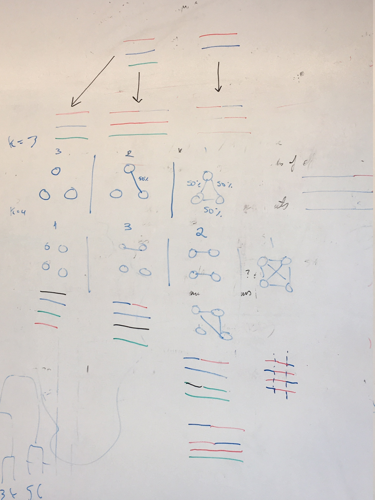

# DEploid-Data-Benchmark-in_silico_field

File structure

```
/
|## Root directory
|-- field_haps/
|      |## PLAF files, asiaGroup1 and africaGroup2 clonal chromosome 14 haplotypes, see README.md for details
|      |-- ...
|      |-- README.md
|-- fixed_IBD/
|      |## Directories for different scenarios
|      |-- k_eq_2/
|      |      |## Currently empty, 
|      |-- k_eq_3/
|      |      |## See README.md for details
|      |      |-- ...
|      |      |-- README.md
|      |-- k_eq_4/
|             |## See README.md for details
|             |-- ...
|             |-- README.md
|-- readCounts/
|      |## Contain reference and alternative allele count for 406 field samples, e.g. PF0778-C_Pf3D7_14_v3_ref.txt.gz, see README.md for details, and how they were generated.
|      |-- ...
|      |-- README.md 
|-- README.md
|-- src/
|      |-- 
|-- variable_IBD/
       |## Currently empty,
```


