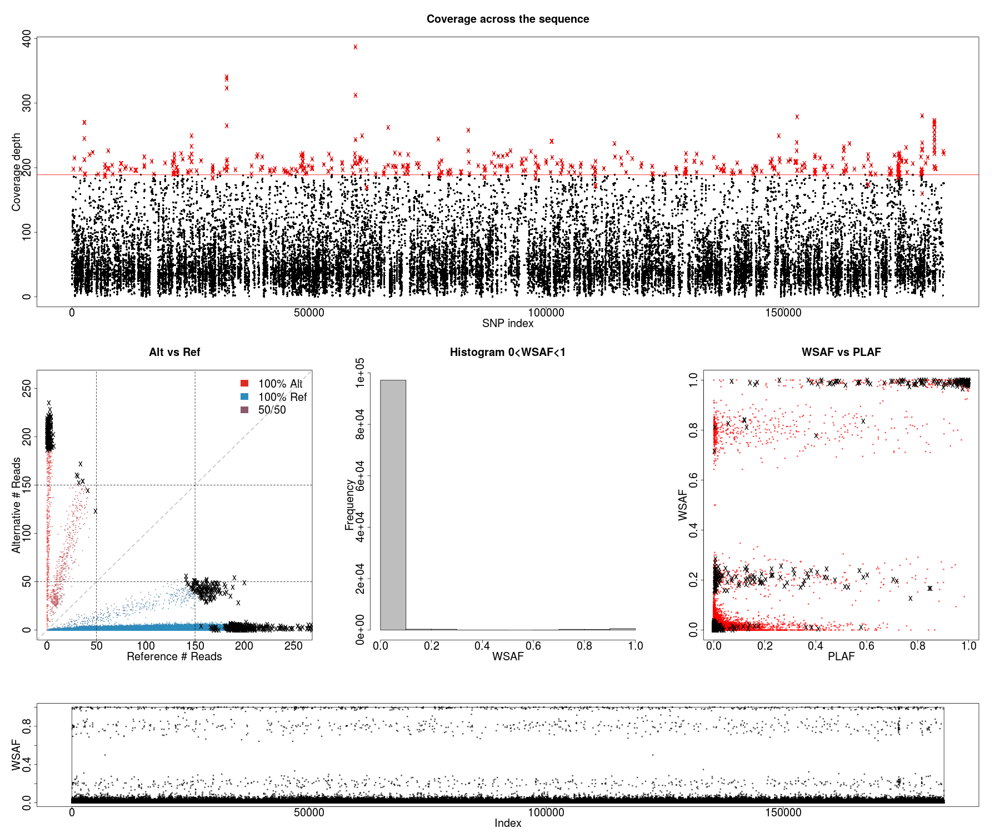
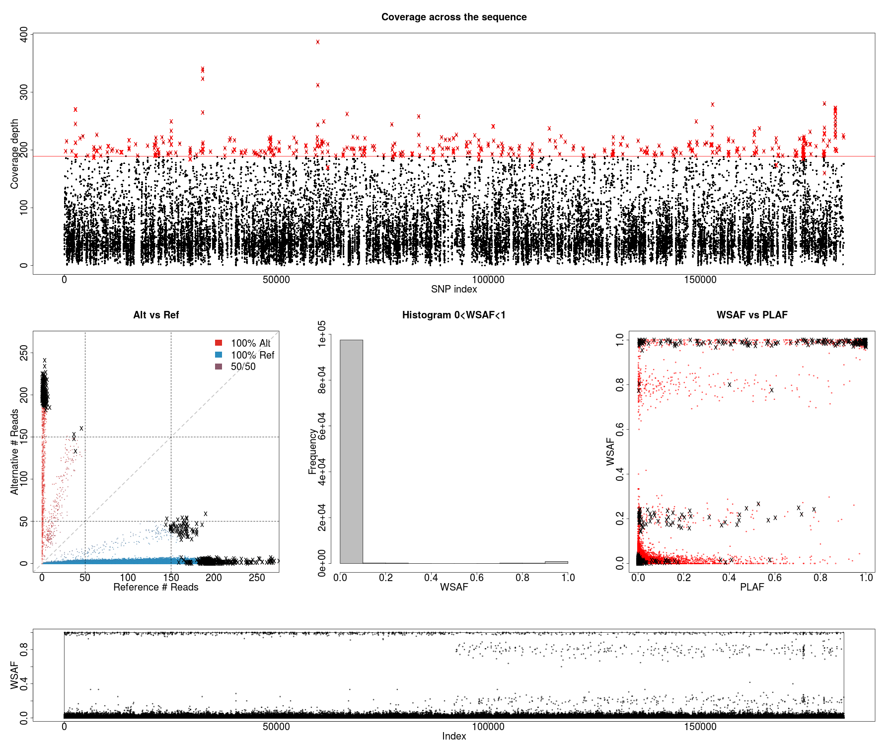
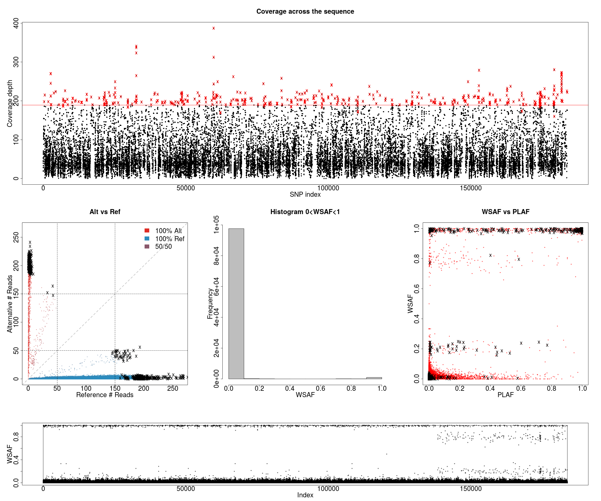

# 2 bites


# 1 bite low relatedness


# 1 bite moderate relatedness


# 1 bite high relatedness


```bash
case=k_eq_2.2bites
dataExplore.r -ref alleleCount/africaGroup2.${case}.6p20v80.ref -alt alleleCount/africaGroup2.${case}.6p20v80.alt -plaf ../../field_haps/africaGroup2_PLAF_14.txt -exclude exclude/africaGroup2.${case}.6.exclude -o ${case}

case=k_eq_2.1bites
dataExplore.r -ref alleleCount/africaGroup2.${case}.6p20v80.ref -alt alleleCount/africaGroup2.${case}.6p20v80.alt -plaf ../../field_haps/africaGroup2_PLAF_14.txt -exclude exclude/africaGroup2.${case}.6.exclude -o ${case}

case=k_eq_2.1bites_high
dataExplore.r -ref alleleCount/africaGroup2.${case}.6p20v80.ref -alt alleleCount/africaGroup2.${case}.6p20v80.alt -plaf ../../field_haps/africaGroup2_PLAF_14.txt -exclude exclude/africaGroup2.${case}.6.exclude -o ${case}

case=k_eq_2.1bites_low
dataExplore.r -ref alleleCount/africaGroup2.${case}.6p20v80.ref -alt alleleCount/africaGroup2.${case}.6p20v80.alt -plaf ../../field_haps/africaGroup2_PLAF_14.txt -exclude exclude/africaGroup2.${case}.6.exclude -o ${case}

```
