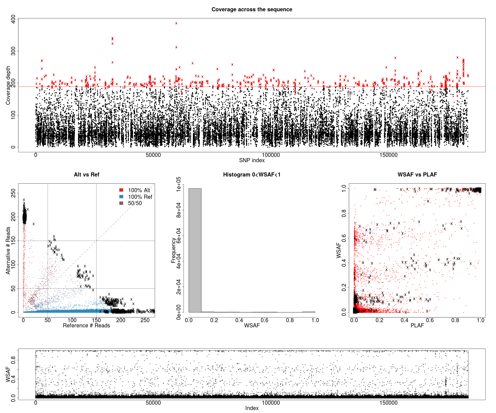
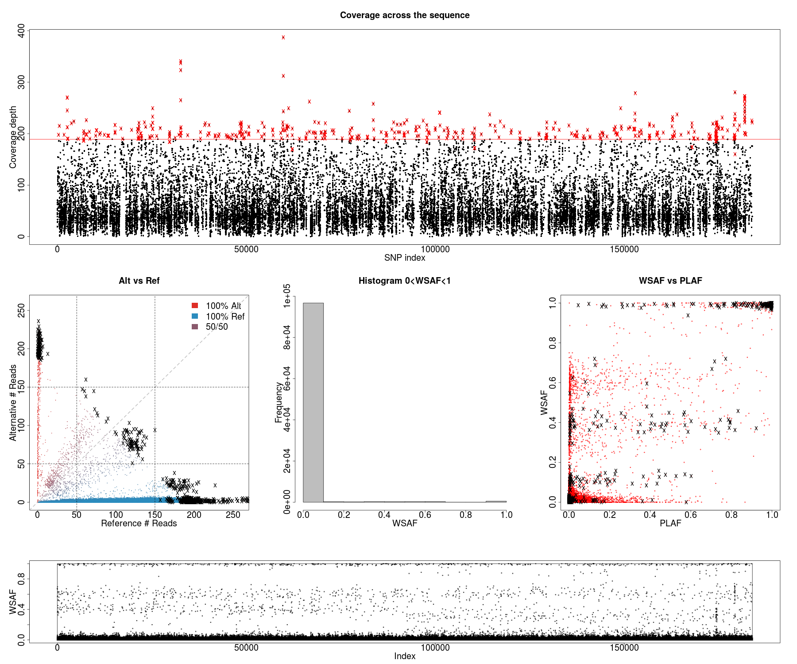
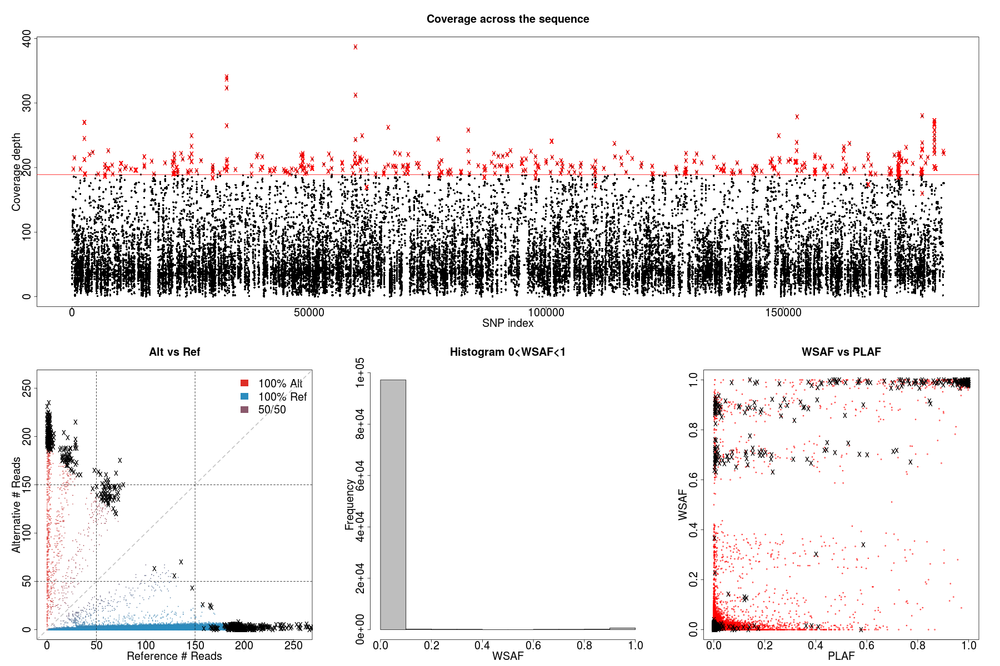

# 3 bites


# 2 bites


# 1 bite



```bash
case=k_eq_3.3bites
dataExplore.r -ref alleleCount/africaGroup2.${case}.6p10v30v60.ref -alt alleleCount/africaGroup2.${case}.6p10v30v60.alt -plaf ../../field_haps/africaGroup2_PLAF_14.txt -exclude exclude/africaGroup2.${case}.6.exclude -o ${case}

case=k_eq_3.2bites
dataExplore.r -ref alleleCount/africaGroup2.${case}.6p10v30v60.ref -alt alleleCount/africaGroup2.${case}.6p10v30v60.alt -plaf ../../field_haps/africaGroup2_PLAF_14.txt -exclude exclude/africaGroup2.${case}.6.exclude -o ${case}

case=k_eq_3.1bites
dataExplore.r -ref alleleCount/africaGroup2.${case}.6p10v30v60.ref -alt alleleCount/africaGroup2.${case}.6p10v30v60.alt -plaf ../../field_haps/africaGroup2_PLAF_14.txt -exclude exclude/africaGroup2.${case}.6.exclude -o ${case}
```
