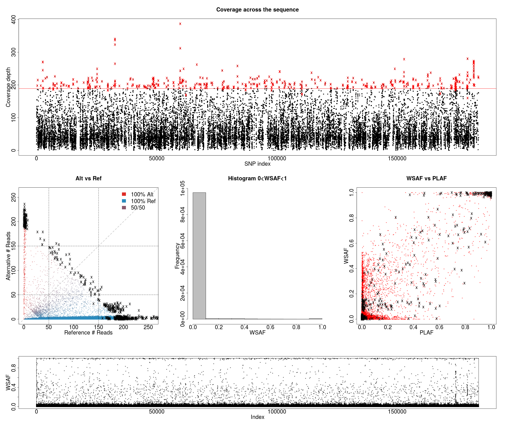
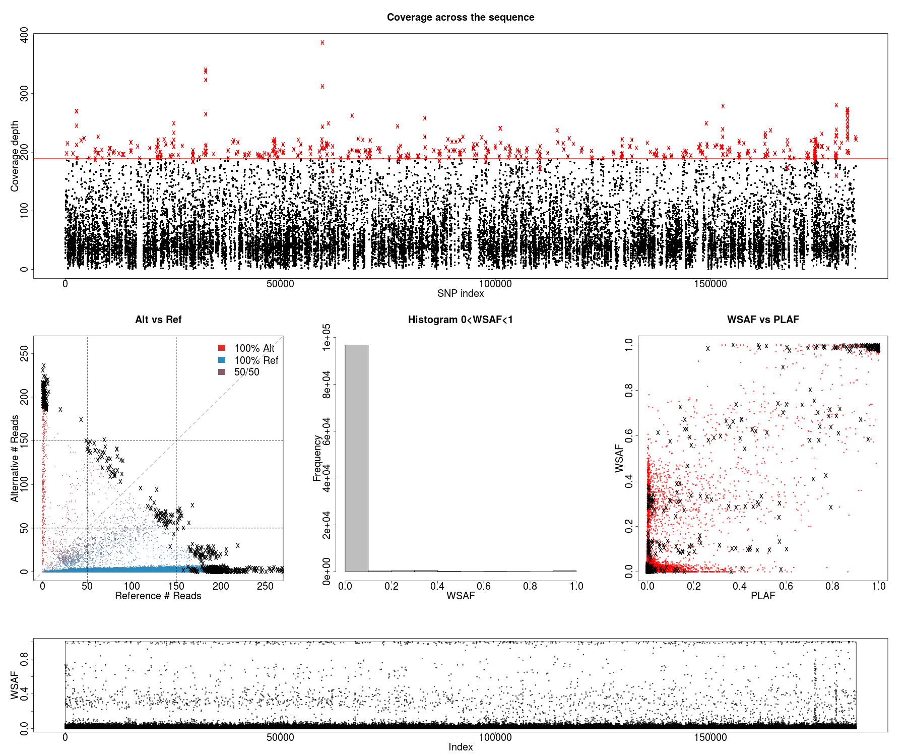
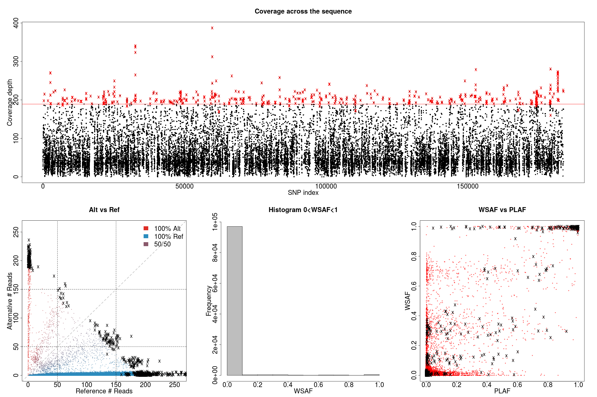
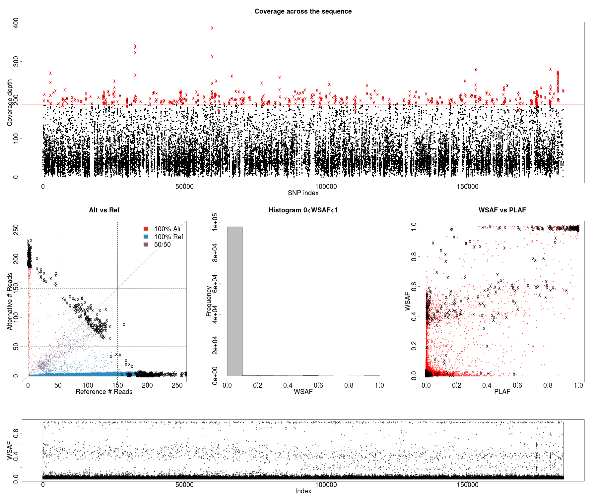
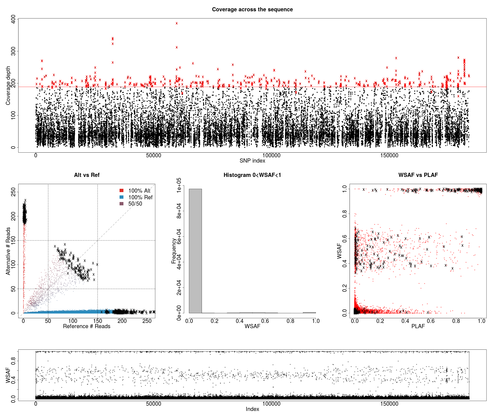

# 4 bites


# 3 bites


# 2 bites
## case 1


## case 2


# 1 bites



```bash
case=k_eq_4.4bites
dataExplore.r -ref alleleCount/africaGroup2.${case}.6p10v20v30v40.ref -alt alleleCount/africaGroup2.${case}.6p10v20v30v40.alt -plaf ../../field_haps/africaGroup2_PLAF_14.txt -exclude exclude/africaGroup2.${case}.6.exclude -o ${case}

case=k_eq_4.3bites
dataExplore.r -ref alleleCount/africaGroup2.${case}.6p10v20v30v40.ref -alt alleleCount/africaGroup2.${case}.6p10v20v30v40.alt -plaf ../../field_haps/africaGroup2_PLAF_14.txt -exclude exclude/africaGroup2.${case}.6.exclude -o ${case}

case=k_eq_4.2bites_case1
dataExplore.r -ref alleleCount/africaGroup2.${case}.6p10v20v30v40.ref -alt alleleCount/africaGroup2.${case}.6p10v20v30v40.alt -plaf ../../field_haps/africaGroup2_PLAF_14.txt -exclude exclude/africaGroup2.${case}.6.exclude -o ${case}

case=k_eq_4.2bites_case2
dataExplore.r -ref alleleCount/africaGroup2.${case}.6p10v20v30v40.ref -alt alleleCount/africaGroup2.${case}.6p10v20v30v40.alt -plaf ../../field_haps/africaGroup2_PLAF_14.txt -exclude exclude/africaGroup2.${case}.6.exclude -o ${case}

case=k_eq_4.1bites
dataExplore.r -ref alleleCount/africaGroup2.${case}.6p10v20v30v40.ref -alt alleleCount/africaGroup2.${case}.6p10v20v30v40.alt -plaf ../../field_haps/africaGroup2_PLAF_14.txt -exclude exclude/africaGroup2.${case}.6.exclude -o ${case}
```
